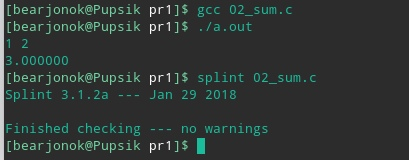

#Практическая работа №1

##1 Цель
 Целью практической работы является ознакомление с онлайн сервисом GitLab. В рамках знакомства нужно: установить операционную систему [ubuntu](https://ru.wikipedia.org/wiki/Ubuntu) и необходиоме программное обеспечение: [gcc](https://ru.wikipedia.org/wiki/GNU_Compiler_Collection), [splint](https://en.wikipedia.org/wiki/Splint_(programming_tool)) и [git](https://ru.wikipedia.org/wiki/Git); выполнить [fork](https://docs.gitlab.com/ee/user/project/repository/forking_workflow.html#creating-a-fork) предоставленного репозитория; [клонировать](https://git-scm.com/docs/git-clone) репозиторий к себе на компьютер; написать программы и убедиться, что они проходят splint и pipeline.

##1.1 Программы 
Требуется реализовать на языке C следующие программы: 
1. Написать программу, печатающую в stdout фразу "Hello, World!" на отдельной строке;
2. Написать программу, принимающую на вход два числа, разделённые пробелом, и суммирующую их. Ввод чисел производить из stdin, вывод результата - в stdout. Вводимые числа не превосходят по модулю 2147483647;
3. Написать программу, принимающую на вход числа x и y, разделённые пробелом, и вычисляющую x в степени y. Ввод чисел производить из stdin, вывод результата - в stdout. Вводимые числа не превосходят по модулю 2147483647. Реализовывать возведение в степень через цикл/рекурсию не допускается.

##2 Ход работы
В качестве операционной системы был выбран ArchLinux, т.к. он содержит много индивидуальных настроек удобных для пользователя, также при работе не возникнет проблем с наличием ПО или установкой тех конфигураций программы. Система была установлена рядом с основной. 
Через командную строку при помощи команды:
`sudo pacman -S gcc, splint, git`, где `sudo` - даёт возможность выполнять операции от имени администратора, а `pacman -S` - позволяет установить пакет.

##2.1 Программа №1
Ниже представлен код программы на языке C:
```c
#include <stdio.h>

int main(void)

{
   printf("Hello, World!\n"); 
   return(0);
} 
``` 
Пример работы программы представлен на рисунке 2.2.1.


Рисунок 2.2.1 - Пример работы программы
 
##2.2 Программа №2
Ниже представлен код программы на языке C:
```c
#include <stdio.h>

int main (void)
{
  double a, b;
  (void) scanf("%lf%lf", &a, &b); 
  printf("%lf\n", a+b);  
  return 0;
} 
``` 
Пример работы программы представлен на рисунке 2.2.2.



Рисунок 2.2.2 - Пример работы программы

##2.2 Программа №3
Ниже представлен код программы на языке C:
```c
#include <stdio.h>
#include <math.h>

int main ()
{
  double x, y;
  (void) scanf("%lf%lf", &x, &y); 
  printf("%lf\n", pow(x, y));  
  return 0;
}
``` 
Пример работы программы представлен на рисунке 2.2.3. 


Рисунок 2.2.3 - Пример работы программы

##Вывод
В ходе лабораторной работы произошло ознакомление с онлайн сервисом GitLab, была установлена система ArchLinux и необходимое обеспечение для выполнения практической работы, также были реальзованы необходимые программы на языке C, успешно проходящие splint и pipeline.

