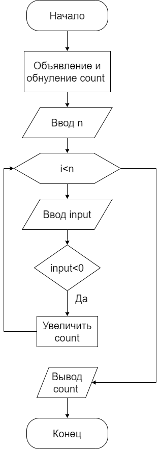
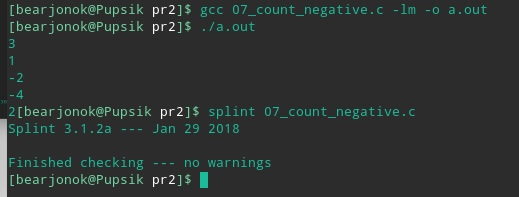
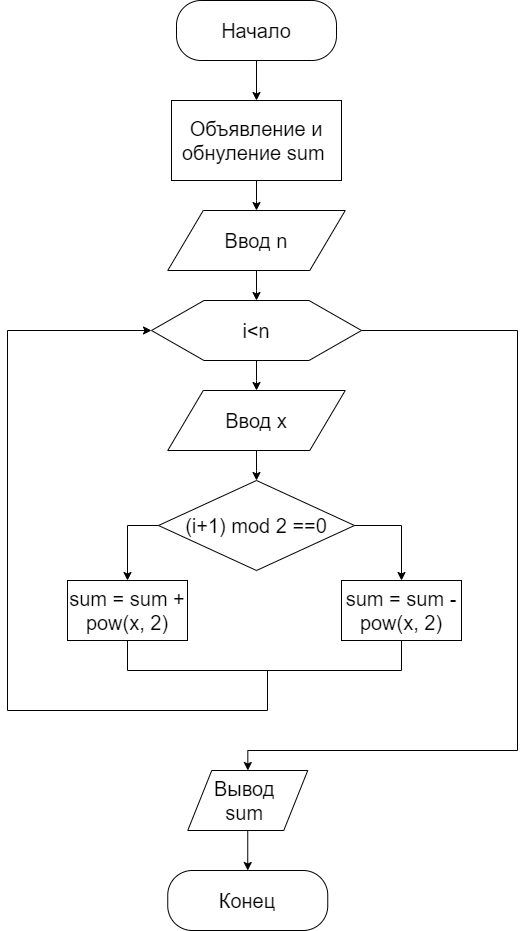
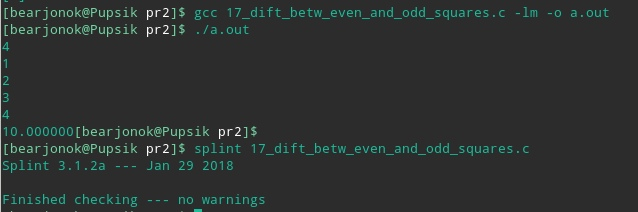

#Практическая работа №2

##1 Цель
Реализовать две задачи в рамках языка C в соответствии с вариантом, составить блок-схемы, настроить Pipeline.

##1.1 Задачи
1. На вход подаётся число 𝑛 ∈ N : 𝑛 ≤ 2147483647, а также 𝑛 чисел 𝑥𝑖 ∈ Z : |𝑥𝑖| ≤ 2147483647 для любого целого 𝑖 от 1 до 𝑛. Вывести количество чисел 𝑥𝑖: 𝑥𝑖 < 0.
2. На вход подаётся число 𝑛 ∈ N : 𝑛 ≤ 2147483647, а также 𝑛 чисел 𝑥𝑖 ∈ Z : |𝑥𝑖| ≤ 2147483647 для любого целого 𝑖 от 1 до 𝑛. Вывести значение ∑︁𝑛=1(−1)𝑖·𝑥2𝑖.

##2 Ход работы
##2.1 Программа 1 (Вариант 7)
Программа получает на вход число `n` обозначающее количество вводимых чисел, далее последовательно вводятся `n` чисел, программа ввыводит колличество отрицательных чисел.
Блок-схема алгоритма представлена на рисунке 2.1.1.



Рисунок 2.1.1 - Блок схема алгорима работы программы 1

Ниже представлен код программы на языке C:
```c
#include <stdio.h>

int main() {
  int n, i, count = 0;
  double input;
  (void) scanf("%i", &n);
  for(i = 0; i < n; i++) {
    (void) scanf("%lf", &input);
    if(input<0) {
        count++;
    }
  }
  printf("%d", count);
  return 0;
} 
``` 
Пример работы программы представлен на рисунке 2.1.2


Рисунок 2.1.2 - Пример работы программы

##2.2 Программа 2 (Вариант 17)
Программа получает на вход число `n` обозначающее количество вводимых чисел, далее последовательно вводятся `n` чисел, программа ввыводит разность сумм чётных и нечётных квадратов.
Блок-схема алгоритма представлена на рисунке 2.2.1.


Рисунок 2.2.1 - Блок схема алгорима работы программы 1

Ниже представлен код программы на языке C:
```c
#include <stdio.h>
#include <math.h>

int main() {
  int n, i;
  double sum = 0, x;
  (void) scanf("%i", &n);
  for(i = 0; i < n; i++) {
    (void) scanf("%lf", &x);
    if((i + 1) % 2 == 0) {
    sum += pow(x, 2);
    } else {
    sum -= pow(x, 2);
  }
  }
  printf("%lf", sum);
  return 0;
} 
``` 
Пример работы программы представлен на рисунке 2.2.2.


Рисунок 2.2.2 - Пример работы программы

##3 Вывод
В рамках практической работы были реализованы две задачи в рамках языка C в соответствии с вариантом, составлены блок-схемы, настроен Pipeline


