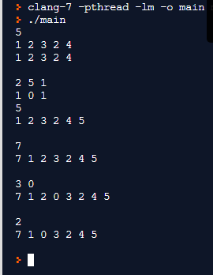

#Практическая работа №3

##1 Цель
Изучить материал, посвящённый односвязным спискам, реализовать функции для работы с односвязным списком в рамках языка C, используя функции реализовать программу, настроить Pipeline.

##1.1 Функции 
```c
// инициализация пустого списка
void init(list *l);

// удалить все элементы из списка
void clean(list *l);

// проверка на пустоту списка
bool is_empty(list *l);

// поиск элемента по значению. вернуть NULL если эжемент не найден
node *find(list *l, int value);

// вставка значения в конец списка, вернуть 0 если успешно
int push_back(list *l, int value);

// вставка значения в начало списка, вернуть 0 если успешно
int push_front(list *l, int value);

// вставка значения после указанного узла, вернуть 0 если успешно
int insert_after(node *n, int value);

// удалить первый элемент из списка с указанным значением, 
// вернуть 0 если успешно
int remove_node(list *l, int value);

// вывести все значения из списка в прямом порядке через пробел,
// после окончания вывода перейти на новую строку
void print(list *l);

``` 

##1.2 Программа
Используя функции реализовать программу, которая:
1. считывает количество элементов n, 0 < n <= 2147483647;
2. создает пустой список, считывает n элементов a, |a| <= 2147483647 и заносит их в список;
3. выводит содержимое списка, используя функцию print;
4. считывает k1, k2, k3 (|k| <= 2147483647) и выводит "1", если в списке существует элемент с таким значением и "0", если нет (выводить через пробел, например "1 0 1");
5. считывает m, |m| <= 2147483647 и вставляет его в конец списка;
6. выводит содержимое списка, используя функцию print;
7. считывает t, |t| <= 2147483647 и вставляет его в начало списка;
8. выводит содержимое списка, используя функцию print;
9. считывает j и x (0 < j <= 2147483647, |x| <= 2147483647) и 
10. вставляет значение x после j-ого элемента списка;
11. выводит содержимое списка, используя функцию print;
считывает z, |z| <= 2147483647 и удаляет первый элемент (при его наличии), хранящий значение z из списка;
12. выводит содержимое списка, используя функцию print;
13. очищает список.

##2 Ход работы
Односвязный список - динамическая структура данных, состоящая из узлов, каждый из которых содержит как собственно данные, так и ссылку на следующий узел списка.
Список задается ссылками на его узлы: начальный и конечный.
```c
typedef struct list {
	struct node *head;  // начало списка
} list;
```
Для того, чтобы описать узил в односвязном списке используем:
```c
typedef struct node {
	int value;          // значение, которое хранит узел 
	struct node *next;  // ссылка на следующий элемент списка
} node;
```

## 2.1 Описание функций
Функция init инициализирует пустой список.
```c
void init(list *l) {
  l->head = NULL;
}
```
Функция clean будет отчищать текущую ноду, пока следующая существует.
```c
void clean(list *l) {
  node *c_node = l->head;
  node *n_node = c_node->next;
  while(n_node != NULL) {
    free(c_node);
    c_node = n_node;
    n_node = c_node->next;
  }
  l->head = NULL;
}
```
Функция is_empty проверяет если начало списка NULL, значит список пуст.
```c
bool is_empty(list *l) {
  if(l->head == NULL) {
    return true;
  }
  return false;
}
```
Функция find будет в цкиле проверять значение каждой ноды, пока не найдёт нужное.
```c
node *find(list *l, int value) {
  node *c_node = l->head;
  while ((c_node != NULL)&&(c_node->value != value)) {
    c_node = c_node->next;
  }
  return c_node;
}
```
Функция push_back работает следующим образом: сначала выделяется память размером sizeof(node), этому участку присваивается знаечение, которое нужно вставить, осуществляется проверка: если список пусть, то значение вставляется, иначе список прокручивается полностью и значение вставляется в конец.
```c
int push_back(list *l, int value) {
  node *push;
  push = malloc(sizeof(node));
  push->value = value;
  push->next = NULL;
  if(l->head == NULL) {
      l->head = push;
  } else {
      node *c_node = l->head;
      while(c_node->next != NULL) {
          c_node = c_node->next;
      }
      c_node->next = push;
  }
  return 0;
}
```
Функция push_front будет проверять начало списка на пустоту, в случае выполнения условия - в начало списка вставляется значение, перемещая конец, иначе нода вставляется в начало, аккуратно смещаяя текущую ноду начала списка.
```c
int push_front(list *l, int value) {
  node *push;
  push = malloc(sizeof(node));
  push->value = value;
  if(l->head == NULL) {
      push->next = NULL;
      l->head = push;
  } else {
      node *n = l->head;
      push->next = n;
      l->head = push;
  }
  return 0;
}
```
Функция insert_after вставляет значение после указнного узла, который ищется в теле программы.
```c
int insert_after(node *n, int value) {
  node *c_node = malloc(sizeof(node));
  c_node->value = value;
  c_node->next = n->next;
  n->next = c_node;
  return 0;
}
```
Функция remove_node удаляет элемент из списка с указанным значением, рассматривая два случая: когда нода в начале и, когда она в любом другом месте.
```c
int remove_node(list *l, int value) {
  if(l->head == NULL) {
    return -1;
  } else {
    node *c_node = l->head;
    node *p_node = NULL;
    while (c_node->next) {
      if (c_node->value == value) {
        if (p_node == NULL) {
          l->head = c_node->next;
          free(c_node);
          return 0;
        }       
        p_node->next = c_node->next;
        free(c_node);
        return 0;
      }
    p_node = c_node;
    c_node = c_node->next;
    }
    return -1;
  }
}
```
Функция print выводит все значени из списка в прямом порядке через пробел.
```c
void print(list *l) {
  node *c_node = l->head;
  while (c_node != NULL) {
    printf("%d ", c_node->value);
    c_node = c_node->next;
  }
  printf("\n");
}
```
На рисунке 2.1.1 представлен результат работы прогпрогарммы.


Рисунок 2.1.1 - Пример работы программы

## Вывод
В ходе лабораторной работы был изучен материал, посвящённый односвязным спискам, реализованы функции для работы с односвязным списком в рамках языка C, используя функции реализована программу, настроен Pipeline.

## Приложение
Полный код программы, реализованный на языке C:
```c
#include <stdio.h>
#include <stdlib.h>
#include <stdbool.h>
#include <assert.h>

typedef struct node {
int value; // значение, которое хранит узел
struct node *next; // ссылка на следующий элемент списка
} node;

typedef struct list {
struct node *head; // начало списка
} list;

// инициализаци¤ пустого списка
void init(list *l);

// удалить все элементы из списка
void clean(list *l);

// проверка на пустоту списка
bool is_empty(list *l);

// поиск элемента по значению. вернуть NULL если эжемент не найден
node *find(list *l, int value);

// вставка значения в конец списка, вернуть 0 если успешно
int push_back(list *l, int value);

// вставка значения в начало списка, вернуть 0 если успешно
int push_front(list *l, int value);

// вставка значени¤ после указанного узла, вернуть 0 если успешно
int insert_after(node *n, int value);

// удалить первый элемент из списка с указанным значением, 
// вернуть 0 если успешно
int remove_node(list *l, int value);

// вывести все значения из списка в прямом порядке через пробел,
// после окончания вывода перейти на новую строку
void print(list *l);

// проверка наличия элемента
void check_b(list *l, int value); 


int main() {
  int n, digit, elem;
  int i = 1;
  list l = {0};
  int check = scanf("%d", &n);
  assert(check == 1);
  while (i <= n) {
    check = scanf("%d", &digit);
    assert(check == 1);
    push_back(&l, digit);
    i++;
  }
  print(&l);
  printf("\n");

  //Нахождение элементов в списке
  i = 1;
  while (i <= 3) {
    check = scanf("%d", &digit);
    assert(check == 1);
    check_b(&l, digit);
    i++;
  }
  printf("\n");

  //Добавление в конец
  check = scanf("%d", &digit);
  assert(check == 1);
  push_back(&l, digit);
  print(&l);
  printf("\n");

  //Добавление в начало
  check = scanf("%d", &digit);
  assert(check == 1);
  push_front(&l, digit);
  print(&l);
  printf("\n");

  //Добавление после указанного элемента
  check = scanf("%d", &digit);
  assert(check == 1);
  check = scanf("%d", &elem);
  assert(check == 1);

  //Находит указанную ноду и передает в функцию insert_after
  node *c_node = l.head;
  int number = 1;
  while ((c_node != NULL)&&(number!= digit)) {
    c_node = c_node->next;
    number++;
  }
  node *insert_head = c_node;
  insert_after(insert_head, elem);
  print(&l);
  printf("\n");

  //Удалить первый элемент равный введенному
  check = scanf("%d", &digit);
  assert(check == 1);
  remove_node(&l, digit);
  print(&l);
  printf("\n");

  //Очистить список
  clean(&l);
  return 0;
};


// инициализаци¤ пустого списка
void init(list *l) {
  l->head = NULL;
}

// удалить все элементы из списка
void clean(list *l) {
  node *c_node = l->head;
  node *n_node = c_node->next;
  while(n_node != NULL) {
    free(c_node);
    c_node = n_node;
    n_node = c_node->next;
  }
  l->head = NULL;
}


// проверка на пустоту списка
bool is_empty(list *l) {
  if(l->head == NULL) {
    return true;
  }
  return false;
}

// поиск элемента по значению. вернуть NULL если элемент не найден
node *find(list *l, int value) {
  node *c_node = l->head;
  while ((c_node != NULL)&&(c_node->value != value)) {
    c_node = c_node->next;
  }
  return c_node;
}

// вставка значения в конец списка, вернуть 0 если успешно
int push_back(list *l, int value) {
  node *push;
  push = malloc(sizeof(node));
  push->value = value;
  push->next = NULL;
  if(l->head == NULL) {
      l->head = push;
  } else {
      node *c_node = l->head;
      while(c_node->next != NULL) {
          c_node = c_node->next;
      }
      c_node->next = push;
  }
  return 0;
}

// вставка значения в начало списка, вернуть 0 если успешно
int push_front(list *l, int value) {
  node *push;
  push = malloc(sizeof(node));
  push->value = value;
  if(l->head == NULL) {
      push->next = NULL;
      l->head = push;
  } else {
      node *n = l->head;
      push->next = n;
      l->head = push;
  }
  return 0;
}

// вставка значения после указанного узла, вернуть 0 если успешно
int insert_after(node *n, int value) {
  node *c_node = calloc(1, sizeof(node));
  c_node->value = value;
  c_node->next = n->next;
  n->next = c_node;
  return 0;
}

// удалить первый элемент из списка с указанным значением,
// вернуть 0 если успешно
int remove_node(list *l, int value) {
  if(l->head == NULL) {
    return -1;
  } else {
    node *c_node = l->head;
    node *p_node = NULL;
    while (c_node->next) {
      if (c_node->value == value) {
        if (p_node == NULL) {
          l->head = c_node->next;
          free(c_node);
          return 0;
        }       
        p_node->next = c_node->next;
        free(c_node);
        return 0;
      }
    p_node = c_node;
    c_node = c_node->next;
    }
    return -1;
  }
}

// вывести все значения из списка в прямом порядке через пробел,
// после окончания вывода перейти на новую строку
void print(list *l) {
  node *c_node = l->head;
  while (c_node != NULL) {
    printf("%d ", c_node->value);
    c_node = c_node->next;
  }
  printf("\n");
}

// проверка наличия элемента
void check_b(list *l, int value) {
  if (find(l, value) != NULL) {
    printf("1 ");
  } else {
printf("0 ");
  }
}
```