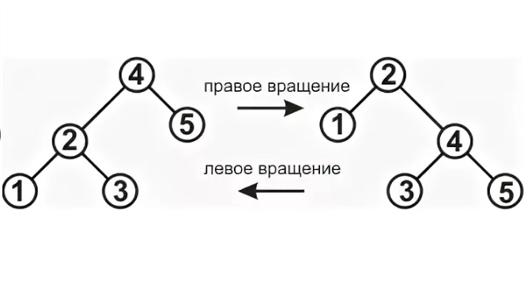
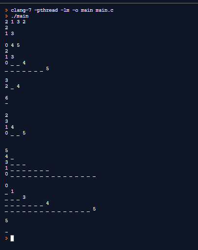

#Практическая работа №5

##1 Цель
Изучить материал, посвящённый бинарным деревьям, реализовать функции для работы с бинарным деревом в рамках языка C, используя функции реализовать программу, настроить Pipeline.

##1.1 Функции 
```c
// Инициализация дерева
void init(tree* t);

// Удалить все элементы из дерева
void clean(tree* t);

// Поиск элемента по значению. Вернуть NULL если элемент не найден
node* find(tree* t, int value);

// Вставка значения в дерево:
// 0 - вставка выполнена успешно
// 1 - элемент существует
// 2 - не удалось выделить память для нового элемента
int insert(tree* t, int value);

// Удалить элемент из дерева:
// 0 - удаление прошло успешно
// 1 - нет элемента с указанным значением
int remove_node(tree* t, int value);

// Удалить минимальный элемент из поддерева, корнем которого является n
// Вернуть значение удаленного элемента
int remove_min(node* n);

// Выполнить правое вращение поддерева, корнем которого является n:
// 0 - успешно выполненная операция
// 1 - вращение невозможно 
int rotate_right(node* n);

// Выполнить левое вращение поддерева, корнем которого является n:
// 0 - успешно выполненная операция
// 1 - вращение невозможно
int rotate_left(node* n);

// Вывести все значения из поддерева, корнем которого является n
// по уровням начиная с корня.
// Каждый уровень выводится на своей строке. 
// Элементы в строке разделяются пробелом. Если элемента нет, заменить на _. 
// Если дерево пусто, вывести -
void print(node* n);

// Вывести все значения дерева t, аналогично функции print
void print_tree(tree* t);
``` 

##1.2 Программа
1. Используя функции реализовать программу, которая:
создает пустое дерево, считывает 4 элемента ai, |ai| <= 2147483647 и заносит их в дерево;
2. выводит дерево (используя функцию print_tree) и пустую строку;
3. считывает 3 элемента ai, |ai| <= 2147483647 и заносит их в дерево;
4. выводит дерево и пустую строку;
5. считывает m1, |m1| <= 2147483647 и ищет элемент с заданным значением в дереве;
выводит через пробел значение предка и потомков найденного элемента,
если нет значений предка или потомков вывести: нижнее подчёркивание вместо таких значений;
вывести тире, если элемент не найден; вывести пустую строку;
6. считывает m2, |m2| <= 2147483647 и ищет элемент с заданным значением в дереве;
выводит через пробел значение предка и потомков найденного элемента,
если нет значений предка или потомков вывести нижнее подчёркивание вместо таких значений;
вывести тире, если элемент не найден; вывести пустую строку;
7. считывает m3, |m3| <= 2147483647 и удаляет из дерева элемент с заданным значением (если такой элемент есть);
8. выводит дерево и пустую строку;
9. выполняет левый поворот дерева относительно корня, пока это возможно;
10. выводит дерево и пустую строку;
11. выполняет правый поворот дерева относительно корня, пока это возможно;
12. выводит дерево и пустую строку;
13. выводит на экран количество элементов в дереве и пустую строку;
14. очищает дерево;
15. выводит дерево и пустую строку;

##2 Ход работы
Бинарное дерево — это конечное множество элементов, которое либо пусто, либо содержит элемент (корень), связанный с двумя различными бинарными деревьями, называемыми левым и правым поддеревьями.
Ниже представлена структура для хранения дерева:
```c
typedef struct tree 
{
    struct node *tmp; //для работы с деревом
    struct node *root; //корень
    int numbers; //количество элементов
} 
tree;
```
Ниже представлена структура, описывающая узел в бинарном дереве:
```c
typedef struct node 
{
    int value;
    struct node *left; //ссылка на левого потомка
    struct node *right;//ссылка на правого потомка
    struct node *parent;//ссылка на родителя
} 
node;
```

## 2.1 Описание функций
Функция init инициализирует пустое бинарное дерево.
```c
void init(tree* t)
{
    t->root=NULL;
}
```
Функция Itachi рекурсивно удаляет левое и правое поддеревья конкретного узла.
```c
node* Itachi(node* t) 
{
    if(t!=NULL)
    {
        Itachi(t->left); 
        Itachi(t->right); 
        if(t->parent!=NULL)
            t->parent = NULL;
        if(t->left!=NULL)
            t->left = NULL;
        if(t->right!=NULL)
            t->right = NULL;
        free(t); 
    }
    return NULL;
} 
```
Функция clean использует корень списка, в качестве ноды от которой начинается удаление, вызывает функцию Itachi и в конце зануляет сам корень.
```c
void clean(tree* t)
{
        node* root = t->root;
        Itachi(root);
        t->root = NULL;
}
```
Функция find осуществляет поиск по конкретному значению: пока значение не найдено функция смотрит к какой ветке относится значение к левой (если меньше родителя) или правой (если больше родителя), если значение не найдено возвращает NULL.
```c
node* find(tree* t, int value)
{
    t->tmp = t->root; 
    while(t->tmp->value != value)
    {
        if(t->tmp->value > value) 
        {
            t->tmp = t->tmp->left; 
        }
        else
        {
            t->tmp = t->tmp->right;
        }
        if(t->tmp == NULL) 
        {
            return NULL;
        }
    }
    return t->tmp;
}
```
Функция insert осуществляет вставку значения в дерево, рассматривая варианты: если дерево пустое, тогда нода становится корнем; и, если дерево содержит какие-то элементы (тогда происходит поиск к какой ветке относится значение к левой (если меньше родителя) или правой (если больше родителя), при этом b_root запоминает предыдущее значение ноды (родительское), в конце по этому же самому принципу определяется куда будет вставлено значение).
```c
int insert(tree* t, int value)
{
    node *a_root = t->root, *b_root = NULL; 
    t->tmp = malloc(sizeof(node)); 
    t->tmp->value = value; 
    if (t->root == NULL)
    {
        t->tmp->parent = NULL; 
        t->tmp->left = NULL; 
        t->tmp->right = NULL; 
        t->root = t->tmp; 
        t->numbers = 1; 
        return 0; 
    }
    while (a_root != NULL) 
    {
        b_root = a_root; 
        if (value == a_root->value) 
                {
                    return 1; 
                }
        if (value < a_root->value) 
        {
            a_root = a_root->left; 
        }
        else 
        {
            a_root = a_root->right; 
        }
    } 
    t->tmp->parent = b_root; 
    t->tmp->left = NULL; 
    t->tmp->right = NULL;
    if (value < b_root->value) 
    {
        b_root->left = t->tmp; 
        t->numbers = t->numbers + 1; 
        return 0; 
    }
    if (value > b_root->value) 
    {
        b_root->right = t->tmp; 
        t->numbers = t->numbers +1; 
        return 0;
    }
  return -1;
}
```
Функция remove_min удаляет минимальный элемент из поддерева, корнем которого является n: осуществляется спуск по левой ветке корня, где в дальнейшем проверяется наличие и значение элементов справа и слева, и в случае выявления минимального, узел отчищается, а значение возвращается.
```c
int remove_min(node* n)
{
    int val;
    node *tmp = n; 
    while (tmp->left != NULL) 
    {
        tmp = tmp->left;  
    }
    val = tmp->value; 
    if(tmp->right != NULL)
    {
        if(val < tmp->parent->value)
        {
            tmp->parent->left = tmp->right;
            free(tmp);
            return val;
        }
        else
        {
            tmp->parent->right = tmp->right;
            free(tmp);
            return val;
        }
    }
    else
    {
        if (val < tmp->parent->value)
        {
            tmp->parent->left = NULL;
            free(tmp);
            return val;
        }
        else
        {
            tmp->parent->right = NULL;
            free(tmp);
            return val;
        }
    }
}
```
Фукнция remove_node удаляет элемент из дерева. Сначала при помощи функции find это значение находится. Потом рассматривается 4 случая: если у ноды нет веток (тогда значение просто освобождается, указатель родителя зануляется); если левая ветка существует, а правая - нет (указатели родителя переназначаются на потомков узла, а потомков - на предка, узел зануляется); если правая ветка существует, а левая - нет (тот же самый принцип, что и у предыдущего); и если существуют обе ветки (тогда для правого значения используется функция поиск минимального, найденное значение присваивается узлу).
```c
int remove_node(tree* t, int value)
{
    int val;
    node *tmp = find(t, value); 
    if (tmp == NULL) 
        return 1;
    if (tmp->left==NULL && tmp->right==NULL)
    {
        if(tmp != t->root) 
        {
            if (tmp->value < tmp->parent->value) 
            {
                tmp->parent->left = NULL; 
                free(tmp); 
                t->numbers = t->numbers-1; 
                return 0; 
            }
            else
            {
                tmp->parent->right = NULL; 
                free(tmp); 
                t->numbers = t->numbers-1; 
                return 0; //конец
            }
        }
        else 
        {
            free(tmp); 
            t->root = NULL; 
            t->numbers = 0;
            return 0;
        }
    }
    if (tmp->left==NULL && tmp->right!=NULL) 
    {
        if(tmp != t->root) 
        {
            if (tmp->value < tmp->parent->value) 
            {
                tmp->parent->left = tmp->right; 
                tmp->right->parent = tmp->parent; 
                free(tmp);
                t->numbers = t->numbers-1; 
                return 0; 
            }
            else 
            {
                tmp->parent->right = tmp->right; 
                tmp->right->parent = tmp->parent; 
                free(tmp); 
                t->numbers = t->numbers-1; 
                return 0; 
            }
        }
        else 
        {
            tmp->right->parent = NULL; 
            t->root = tmp->right; 
            free(tmp); 
            t->numbers = t->numbers-1; 
            return 0; 
        }
    }
    if (tmp->left!=NULL && tmp->right==NULL) 
    {
        if(tmp !=t->root) 
        {
            if (tmp->value < tmp->parent->value) 
            {
                tmp->parent->left = tmp->left;
                tmp->left->parent = tmp->parent;
                free(tmp);
                t->numbers = t->numbers-1;
                return 0;
            }
            else 
            {
                tmp->parent->right = tmp->left;
                tmp->left->parent = tmp->parent;
                free(tmp);
                t->numbers = t->numbers-1;
                return 0;
            }
        }
        else 
        {
            tmp->left->parent = NULL; 
            t->root = tmp->left; 
            free(tmp); 
            t->numbers = t->numbers-1; 
            return 0; 
        }
    }
    if(tmp->right!=NULL && tmp->left!=NULL) 
    {
        val = remove_min(tmp->right); 
        tmp->value = val; 
        t->numbers = t->numbers-1; 
        return 0; 
    }
  return -1;
}
```
Перед описанием следующих функций следует пояснить, что такое вращение бинарного дерева (модель представлена на рисунке 2.1.1). Поворот дерева - это операция, которая позволяет изменить структуру дерева не меняя порядка элементов. Особенность этих операций в том, что они могут уменьшить высоту дерева. Используя эти операции для соответствующих узлов можно минимизировать высоту дерева.


Рисунок 2.1.1 - Вращение бинарного дерева
Соответсвенно функция rotate_right делает в точности то, что представлено на рисунке (правый поворот).
```c
int rotate_right(node* n)
{
    node* root = n;
    node* new_root = root->left;
        node* rotate = new_root->right;
        new_root->parent = root->parent;
        if(root->parent != NULL)
        {
            if(root->parent->value > root->value)
            {
                root->parent->left = new_root;
            }
            else
            {
                root->parent->right = new_root;
            }
        }
        
        if(rotate!=NULL)
        {
            rotate->parent = root;
        }
    root->left = rotate;
    root->parent = new_root;
    new_root->right = root;
    return 0;
}
```
Аналогично работает функция rotate_left.
```c
int rotate_left(node* n)
{
    node* root = n;
    node* new_root = root->right;
    node* rotate = new_root->left;
        new_root->parent = root->parent;
    if(root->parent != NULL)
    {
        if(root->parent->value > root->value)
        {
            root->parent->left = new_root;
        }
        else
        {
            root->parent->right = new_root;
        }
    }
    if(rotate!=NULL)
    {
    rotate->parent = root;
    }
    root->right = rotate;
    root->parent = new_root;
    new_root->left = root;
    return 0;
}
```
Функция get_levels рекурсивно вычисляет колличесвто уровней в дереве по правой и левой ветке, и выбирает большее из них. 
```c
int get_levels(node* tmp) 
{
    if (tmp == NULL)
    {
        return 0;
    }
    int leftmax = 1 + get_levels(tmp->left);
    int rightmax = 1 + get_levels(tmp->right);
    if (leftmax > rightmax)
    {
        return leftmax;
    }
    else
    {
        return rightmax;
    }
}
```
Функция print_level осуществляет вывод дерева, начиная с конкртеной ноды.
```c
void print_level(node* tmp, int curl, int d, int first) 
{
    if (curl == d)
    {
        if (first > 0)
        {
            printf(" ");
        }

        if (tmp == NULL) {
        printf("_");
        }
        else
        {
        printf("%d", tmp->value);
        }
    }
    else if (tmp != NULL) 
    {
        print_level(tmp->left, curl + 1, d, first);
        print_level(tmp->right, curl + 1, d, first + 1);
    }
    else 
    {
        print_level(tmp, curl + 1, d, first);
        print_level(tmp, curl + 1, d, first + 1);
    }
}
```
Функция print использует функцию get_levels для того, чтобы получить глубину дерева для организации цикла вывода, и далее при помощи print_level печатает всё дерево, используя конкретную ноду вкачетсве начала
```c
void print(node* n)
{
    int num = get_levels(n);
    for (int i = 1; i <= num; i++)
    {
        print_level(n, 1, i, 0);
        printf("\n");
    }
}
```
Функция print_tree выводит всё дерево.
```c
void print_tree(tree* t)
{
    node* n = t->root;
    if (n == NULL) 
    {
    printf("-");
    printf("\n");
    }
    print(t->root);
}
```
На рисунке 2.1.2 представлен результат работы прогпрогарммы.



Рисунок 2.1.2 - Пример работы программы

## Вывод
В ходе лабораторной работы был изучен материал, посвящённый бинарным деревьям, реализованы функции для работы с бинарным деревом в рамках языка C, используя функции реализована программу, настроен Pipeline.

## Приложение
Полный код программы, реализованный на языке C:
```c
#include <stdio.h>
#include <stdlib.h>
#include <stdbool.h>
#include <assert.h>

// Структура для хранения узла дерева.
typedef struct node 
{
    int value;
    struct node *left; //ссылка налево
    struct node *right;//ссылка направо
    struct node *parent;//ссылка на родителя
} 
node;

// Структура для хранения дерева.
typedef struct tree 
{
    struct node *tmp; //для работы с деревом
    struct node *root; //корень
    int numbers; //количество элементов
} 
tree;

// Инициализация дерева
void init(tree* t);

//Функция рекурсивного удаления из любого места
node* Itachi(node* t);

// Удалить все элементы из дерева
void clean(tree* t);

// Поиск элемента по значению. Вернуть NULL если элемент не найден
node* find(tree* t, int value);

// Вставка значения в дерево:
// 0 - вставка выполнена успешно
// 1 - элемент существует
// 2 - не удалось выделить память для нового элемента
int insert(tree* t, int value);

// Удалить элемент из дерева:
// 0 - удаление прошло успешно
// 1 - нет элемента с указанным значением
int remove_node(tree* t, int value);

// Удалить минимальный элемент из поддерева, корнем которого является n
// Вернуть значение удаленного элемента
int remove_min(node* n);

// Выполнить правое вращение поддерева, корнем которого является n:
// 0 - успешно выполненная операция
// 1 - вращение невозможно 
int rotate_right(node* n);

// Выполнить левое вращение поддерева, корнем которого является n:
// 0 - успешно выполненная операция
// 1 - вращение невозможно
int rotate_left(node* n);

// получение кол-во уровней в дереве
int get_levels(node* tmp);

//функция для вывода уровня
void print_level(node* tmp, int curl, int d, int first);

// Вывести все значения из поддерева, корнем которого является n
// по уровням начиная с корня.
// Каждый уровень выводится на своей строке. 
// Элементы в строке разделяются пробелом. Если элемента нет, заменить на _. 
// Если дерево пусто, вывести -
void print(node* n);

// Вывести все значения дерева t, аналогично функции print
void print_tree(tree* t);

//Вывод количества элементов в списке
void print_num(tree* t); 

int main()
{
    int a, i, n1, n2;
    struct tree t;
    init(&t);
    
    //ввод первых 4х чисел
    for (i=0; i<4; i++)
    {
        scanf("%d", &a);
        insert(&t, a);
    }
    print_tree(&t);
    printf("\n");
    
    //ввод ещё 3х чисел
    for (i=0; i<3; i++)
    {
        scanf("%d", &a);
        insert(&t, a);
    }
    print_tree(&t);
    printf("\n");
    
    //вывод потомков и предка элемента
    scanf("%d", &n1);
    node *x = find(&t, n1);
    if(x==NULL)
    {
        printf("-");
        printf("\n");
    }
    else
    {
        if (x->parent != NULL)
        {
            printf("%d", x->parent->value);
            printf(" ");
        }
        else
        {
            printf("_ ");
        }
        if(x->left)
        {
            printf("%d", x->left->value);
        }
        else
        {
            printf("_");
        }
        printf(" ");
        if(x->right)
        {
            printf("%d", x->right->value);
        }
        else
        {
            printf("_");
        }
        printf("\n");
    }
    printf("\n");
    
    scanf("%d", &n2);
    x = find(&t, n2);
    if(x==NULL)
    {
        printf("-");
        printf("\n");
    }
    else
    {
        if (x->parent != NULL)
        {
            printf("%d", x->parent->value);
            printf(" ");
        }
        else
        {
            printf("_ ");
        }
        if(x->left)
        {
            printf("%d", x->left->value);
        }
        else
        {
            printf("_");
        }
        printf(" ");
        if(x->right)
        {
            printf("%d", x->right->value);
        }
        else
        {
            printf("_");
        }
        printf("\n");
    }
    printf("\n");
    
    //удаление элемента
    scanf("%d", &n1);
    remove_node(&t, n1);
    print_tree(&t);
    printf("\n");
    
    //левые вращения
    node* troot = t.root;
    if (troot != NULL)
    {
        while (troot->right != NULL)
        {
             rotate_left(t.root);
          if (t.root->parent != NULL)
          {
              t.root = t.root->parent;
          }
        troot =t.root;
        }
    }
    printf("\n");
    print_tree(&t);
    
    //правые вращения
    troot = t.root;
    if(troot != NULL)
    {
        while (troot->left != NULL)
        {
          rotate_right(t.root);
            if (t.root->parent != NULL)
            {
              t.root = t.root->parent;
            }
          troot = t.root;
        }
    }
    printf("\n");
    print_tree(&t);
    
    //кол-во элементов
    printf("\n");
    print_num(&t);
    printf("\n\n");
    
    //очистка дерева
    clean(&t);
    troot = t.root;
    print_tree(&t);
    return 0;
}

// Инициализация дерева
void init(tree* t)
{
    t->root=NULL;
}


//Функция рекурсивного удаления из любого места
node* Itachi(node* t) 
{
    if(t!=NULL)
    {
        Itachi(t->left); 
        Itachi(t->right); 
        if(t->parent!=NULL)
            t->parent = NULL;
        if(t->left!=NULL)
            t->left = NULL;
        if(t->right!=NULL)
            t->right = NULL;
        free(t); 
    }
    return NULL;
}


// Удалить все элементы из дерева
void clean(tree* t)
{
        node* root = t->root;
        Itachi(root);
        t->root = NULL;
}


// Поиск элемента по значению. Вернуть NULL если элемент не найден
node* find(tree* t, int value)
{
    t->tmp = t->root; 
    while(t->tmp->value != value)
    {
        if(t->tmp->value > value) 
        {
            t->tmp = t->tmp->left; 
        }
        else
        {
            t->tmp = t->tmp->right;
        }
        if(t->tmp == NULL) 
        {
            return NULL;
        }
    }
    return t->tmp;
}

 

// Вставка значения в дерево:
// 0 - вставка выполнена успешно
// 1 - элемент существует
// 2 - не удалось выделить память для нового элемента
int insert(tree* t, int value)
{
    node *a_root = t->root, *b_root = NULL; 
    t->tmp = malloc(sizeof(node)); 
    t->tmp->value = value; 
    if (t->root == NULL)
    {
        t->tmp->parent = NULL; 
        t->tmp->left = NULL; 
        t->tmp->right = NULL; 
        t->root = t->tmp; 
        t->numbers = 1; 
        return 0; 
    }
    while (a_root != NULL) 
    {
        b_root = a_root; 
        if (value == a_root->value) 
                {
                    return 1; 
                }
        if (value < a_root->value) 
        {
            a_root = a_root->left; 
        }
        else 
        {
            a_root = a_root->right; 
        }
    } 
    t->tmp->parent = b_root; 
    t->tmp->left = NULL; 
    t->tmp->right = NULL;
    if (value < b_root->value) 
    {
        b_root->left = t->tmp; 
        t->numbers = t->numbers + 1; 
        return 0; 
    }
    if (value > b_root->value) 
    {
        b_root->right = t->tmp; 
        t->numbers = t->numbers +1; 
        return 0;
    }
  return -1;
}


// Удалить минимальный элемент из поддерева, корнем которого является n
// Вернуть значение удаленного элемента

int remove_min(node* n)
{
    int val;
    node *tmp = n; 
    while (tmp->left != NULL) 
    {
        tmp = tmp->left;  
    }
    val = tmp->value; 
    if(tmp->right != NULL)
    {
        if(val < tmp->parent->value)
        {
            tmp->parent->left = tmp->right;
            free(tmp);
            return val;
        }
        else
        {
            tmp->parent->right = tmp->right;
            free(tmp);
            return val;
        }
    }
    else
    {
        if (val < tmp->parent->value)
        {
            tmp->parent->left = NULL;
            free(tmp);
            return val;
        }
        else
        {
            tmp->parent->right = NULL;
            free(tmp);
            return val;
        }
    }
}


// Удалить элемент из дерева:
// 0 - удаление прошло успешно
// 1 - нет элемента с указанным значением
int remove_node(tree* t, int value)
{
    int val;
    node *tmp = find(t, value); 
    if (tmp == NULL) 
        return 1;
    if (tmp->left==NULL && tmp->right==NULL)
    {
        if(tmp != t->root) 
        {
            if (tmp->value < tmp->parent->value) 
            {
                tmp->parent->left = NULL; 
                free(tmp); 
                t->numbers = t->numbers-1; 
                return 0; 
            }
            else
            {
                tmp->parent->right = NULL; 
                free(tmp); 
                t->numbers = t->numbers-1; 
                return 0; //конец
            }
        }
        else 
        {
            free(tmp); 
            t->root = NULL; 
            t->numbers = 0;
            return 0;
        }
    }
    if (tmp->left==NULL && tmp->right!=NULL) 
    {
        if(tmp != t->root) 
        {
            if (tmp->value < tmp->parent->value) 
            {
                tmp->parent->left = tmp->right; 
                tmp->right->parent = tmp->parent; 
                free(tmp);
                t->numbers = t->numbers-1; 
                return 0; 
            }
            else 
            {
                tmp->parent->right = tmp->right; 
                tmp->right->parent = tmp->parent; 
                free(tmp); 
                t->numbers = t->numbers-1; 
                return 0; 
            }
        }
        else 
        {
            tmp->right->parent = NULL; 
            t->root = tmp->right; 
            free(tmp); 
            t->numbers = t->numbers-1; 
            return 0; 
        }
    }
    if (tmp->left!=NULL && tmp->right==NULL) 
    {
        if(tmp !=t->root) 
        {
            if (tmp->value < tmp->parent->value) 
            {
                tmp->parent->left = tmp->left;
                tmp->left->parent = tmp->parent;
                free(tmp);
                t->numbers = t->numbers-1;
                return 0;
            }
            else 
            {
                tmp->parent->right = tmp->left;
                tmp->left->parent = tmp->parent;
                free(tmp);
                t->numbers = t->numbers-1;
                return 0;
            }
        }
        else 
        {
            tmp->left->parent = NULL; 
            t->root = tmp->left; 
            free(tmp); 
            t->numbers = t->numbers-1; 
            return 0; 
        }
    }
    if(tmp->right!=NULL && tmp->left!=NULL) 
    {
        val = remove_min(tmp->right); 
        tmp->value = val; 
        t->numbers = t->numbers-1; 
        return 0; 
    }
  return -1;
}

// Выполнить правое вращение поддерева, корнем которого является n:
// 0 - успешно выполненная операция
// 1 - вращение невозможно 
int rotate_right(node* n)
{
    node* root = n;
    node* new_root = root->left;
        node* rotate = new_root->right;
        new_root->parent = root->parent;
        if(root->parent != NULL)
        {
            if(root->parent->value > root->value)
            {
                root->parent->left = new_root;
            }
            else
            {
                root->parent->right = new_root;
            }
        }
        
        if(rotate!=NULL)
        {
            rotate->parent = root;
        }
    root->left = rotate;
    root->parent = new_root;
    new_root->right = root;
    return 0;
}

// Выполнить левое вращение поддерева, корнем которого является n:
// 0 - успешно выполненная операция
// 1 - вращение невозможно
int rotate_left(node* n)
{
    node* root = n;
    node* new_root = root->right;
    node* rotate = new_root->left;
        new_root->parent = root->parent;
    if(root->parent != NULL)
    {
        if(root->parent->value > root->value)
        {
            root->parent->left = new_root;
        }
        else
        {
            root->parent->right = new_root;
        }
    }
    if(rotate!=NULL)
    {
    rotate->parent = root;
    }
    root->right = rotate;
    root->parent = new_root;
    new_root->left = root;
    return 0;
}


// получение кол-во уровней в дереве
int get_levels(node* tmp) 
{
    if (tmp == NULL)
    {
        return 0;
    }
    int leftmax = 1 + get_levels(tmp->left);
    int rightmax = 1 + get_levels(tmp->right);
    if (leftmax > rightmax)
    {
        return leftmax;
    }
    else
    {
        return rightmax;
    }
}


//функция для вывода уровня
void print_level(node* tmp, int curl, int d, int first) 
{
    if (curl == d)
    {
        if (first > 0)
        {
            printf(" ");
        }

        if (tmp == NULL) {
        printf("_");
        }
        else
        {
        printf("%d", tmp->value);
        }
    }
    else if (tmp != NULL) 
    {
        print_level(tmp->left, curl + 1, d, first);
        print_level(tmp->right, curl + 1, d, first + 1);
    }
    else 
    {
        print_level(tmp, curl + 1, d, first);
        print_level(tmp, curl + 1, d, first + 1);
    }
}


// Вывести все значения из поддерева, корнем которого является n
// по уровням начиная с корня.
// Каждый уровень выводится на своей строке. 
// Элементы в строке разделяются пробелом. Если элемента нет, заменить на _. 
// Если дерево пусто, вывести -
void print(node* n)
{
    int num = get_levels(n);
    for (int i = 1; i <= num; i++)
    {
        print_level(n, 1, i, 0);
        printf("\n");
    }
}

// Вывести все значения дерева t, аналогично функции print
void print_tree(tree* t)
{
    node* n = t->root;
    if (n == NULL) 
    {
    printf("-");
    printf("\n");
    }
    print(t->root);
}

//Вывод количества элементов в списке
void print_num(tree* t) 
{
    printf("%d", t->numbers);
}

```